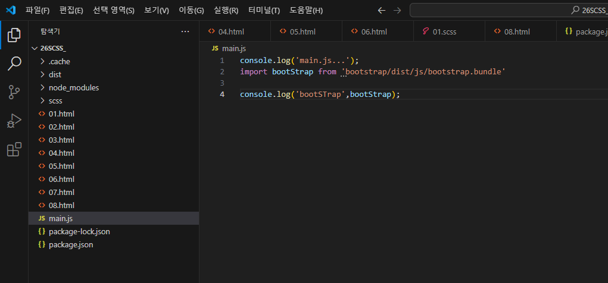

# SCSS


|참고|
|-|
|[공식문서](https://www.sassmeister.com/)|
|[SASS SCSS CSS 차이](https://velog.io/@jch9537/CSS-SCSS-SASS)|
|[코드보기](https://github.com/NATIONAL-WEB-FUNDING-LECTURE/02_FN_IMPL/tree/main/RENEWAL(2024)/26SCSS_)|

<p align="center"></p>


INDEX
---
|-|
|-|
|개요|
|프로젝트 생성|
|주석|
|중첩|
|변수|
|연산자|
|@Mixins|
|반복문|
|함수|
|색상 내장함수|
|가져오기|


개요
---
<p align="center"></p>
<p align="center"></p>

>SASS(Syntactically Awesome Style Sheets) 란
```
- 대표적인 CSS 전처리기 중 하나이다.
- CSS가 동작하기 전에 사용하는 기능으로 CSS Preprocessor라고 부른다.
- CSS 문법과 유사하지만 선택자의 중첩이나 조건문, 반복문 등을 사용하여 더 편리하게 작성할 수 있다.
- 웹에서는 직접 동작하지 않으므로 전처리기로 작성 후 CSS로 컴파일하는 방식으로 사용한다.
```

>SCSS(Sassy CSS)란
```
- Sass의 3버전에서 새롭게 등장한 것으로, CSS와 거의 같은 문법으로 Sass 기능을 지원한다.
- {}(중괄호)와 ;(세미콜론)을 사용하는 점이 두드러진 차이이다
```

프로젝트 생성
---
```
- Step 1
    - npm init -y 
- Step 2
    - npm i -D parcel-bundler
- Step 3
    - package.json->
    - "scripts": {
         "dev" : "parcel 01.html",
      "build" : "parcel build 01.html" 
    - },
- Step 4
    - npm run dev 
```


주석
---
- /* */
- //


중첩
---

---

<p align="center"></p>
<p align="center"></p>
<p align="center"></p>
<p align="center"></p>

---


변수
---

---
<p align="center"></p>

---


연산
---

---
<p align="center"></p>

---


재활용 -  @Mixins
---

---

<p align="center"></p>
<p align="center"></p>
<p align="center"></p>
<p align="center"></p>

---


반복문 - @for
---

---
<p align="center"></p>

---


함수 - @function
---
>함수기본
---
<p align="center"></p>

---

>내장함수
---
<p align="center"></p>

---

가져오기 - @import
---

---
<p align="center"></p>

---


자료형

---
<p align="center"></p>

---


반복처리 - @each
---

---
<p align="center"></p>

---


@content
---

---
<p align="center"></p>

---

 
Bootstrap5 연동
---


<p align="center"></p>
<p align="center"></p>
<p align="center"></p>
<p align="center"></p>
<p align="center"></p>
<p align="center"></p>
<p align="center"></p>
<p align="center"></p>
<p align="center"></p>
<p align="center"></p>


 
Bootstrap5 SCSS 변수값 수정
---

<p align="center"></p>
<p align="center"></p>
<p align="center"></p>
<p align="center"></p>
<p align="center"></p>
<p align="center"></p>
<p align="center"></p>
