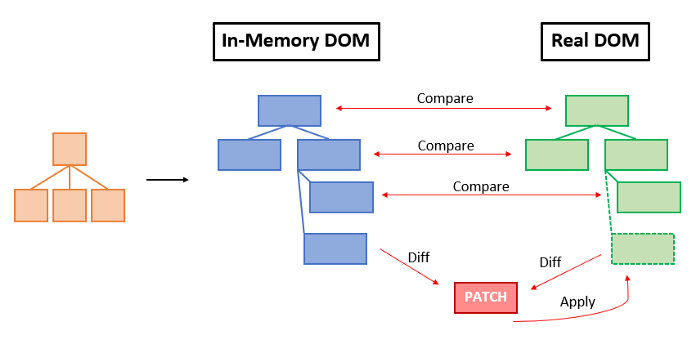

# REACT 

|참고|
|-|
|[React 공식 문서](https://react.dev/)|
|[React GitHub 리포지토리](https://github.com/facebook/react)|
|[Create React App 공식 문서](https://create-react-app.dev/docs/getting-started/)|


---
리액트
---
> 리액트란
```
React는 Facebook에서 개발하고 유지 관리하는 오픈 소스 자바스크립트 라이브러리로, 사용자 인터페이스(UI)를 구축하기 위해 사용됩니다.
주로 단일 페이지 애플리케이션(SPA)에서 빠르고 효율적인 UI 업데이트를 위해 사용됩니다.
React는 컴포넌트 기반 아키텍처를 사용하여 복잡한 UI를 작은, 재사용 가능한 컴포넌트로 분할할 수 있게 해줍니다.
```

> 리액트 특징 및 장점
```
컴포넌트 기반 아키텍처:
  React는 UI를 독립적이고 재사용 가능한 컴포넌트로 분할할 수 있게 해줍니다.
  각 컴포넌트는 자체적인 상태(state)와 속성(props)을 가지며, 이를 통해 복잡한 UI를 관리하기 쉽게 만듭니다.

Virtual DOM:
  React는 Virtual DOM을 사용하여 실제 DOM 조작을 최소화합니다.
  Virtual DOM은 메모리 내에서 가상의 DOM 트리를 만들고, 실제 DOM과의 차이를 비교하여 최소한의 변경만 실제 DOM에 적용합니다.
  이를 통해 성능이 크게 향상됩니다.

단방향 데이터 흐름:
  React는 단방향 데이터 흐름(단방향 바인딩)을 사용하여 데이터가 부모 컴포넌트에서 자식 컴포넌트로 전달됩니다.
  이는 데이터의 흐름을 추적하기 쉽게 만들며, 애플리케이션의 상태 관리를 단순화합니다.

JSX:
  JSX는 JavaScript XML의 약자로, JavaScript 코드 안에서 HTML과 유사한 구문을 사용할 수 있게 해줍니다.
  JSX는 코드의 가독성을 높여주며, React 컴포넌트를 작성하는 데 매우 유용합니다.

React Hooks:
  Hooks는 함수형 컴포넌트에서 상태와 생명주기 메서드를 사용할 수 있게 해줍니다.
  useState, useEffect, useContext 등 다양한 기본 Hook이 제공됩니다.

커뮤니티와 생태계:
  React는 매우 활발한 오픈 소스 커뮤니티를 가지고 있습니다.
  풍부한 서드파티 라이브러리와 도구들이 React와 함께 사용될 수 있습니다.
  Redux, React Router, Styled-components 등 많은 라이브러리가 React 생태계를 더욱 강화합니다.

서버사이드 렌더링(SSR):
  Next.js와 같은 프레임워크를 사용하면, React 애플리케이션에서 서버사이드 렌더링을 구현할 수 있습니다.
  이는 SEO(검색 엔진 최적화)에 유리하며, 초기 로딩 시간을 단축시킬 수 있습니다.

지속적인 업데이트와 개선:
  React는 Facebook에 의해 지속적으로 업데이트되고 있으며, 커뮤니티의 피드백을 반영하여 새로운 기능이 추가되고 성능이 개선되고 있습니다.
```


> 리액트 핵심기술
```
1. 컴포넌트 기반 아키텍처
  **컴포넌트(Component)**는 React 애플리케이션의 기본 빌딩 블록입니다.
  컴포넌트는 독립적이고 재사용 가능한 코드 조각으로, 각 컴포넌트는 자신의 상태와 속성을 관리합니다.
```
|-|
|-|
||

```
2. JSX (JavaScript XML)
JSX는 JavaScript와 XML을 결합한 문법으로, React 컴포넌트를 정의할 때 사용됩니다.
JSX는 HTML처럼 보이지만 실제로는 JavaScript 객체로 변환됩니다.
```
|-|
|-|
||

```
3. Virtual DOM
Virtual DOM은 React의 핵심 개념 중 하나입니다. 실제 DOM 조작은 비용이 많이 드는 작업이므로,
React는 Virtual DOM을 사용하여 최소한의 실제 DOM 업데이트만 수행합니다.

  Virtual DOM: 메모리 내에서 실제 DOM의 가상 표현을 유지합니다.
  Diffing: 두 개의 Virtual DOM 트리를 비교하여 변경된 부분만 실제 DOM에 적용합니다.
  Reconciliation: 변경된 부분을 실제 DOM에 효율적으로 업데이트하는 과정입니다.

```
|-|
|-|
||
||

> Virtual DOM 동작원리 <br>

|-|
|-|
|[바로가기](https://velog.io/@liso_o/React-Virtual-Dom-%EC%9D%B4%EB%9E%80)|
|[바로가기](https://junilhwang.github.io/TIL/Javascript/Design/Vanilla-JS-Virtual-DOM/#_4-diff-%E1%84%8B%E1%85%A1%E1%86%AF%E1%84%80%E1%85%A9%E1%84%85%E1%85%B5%E1%84%8C%E1%85%B3%E1%86%B7-%E1%84%8C%E1%85%A5%E1%86%A8%E1%84%8B%E1%85%AD%E1%86%BC)|

