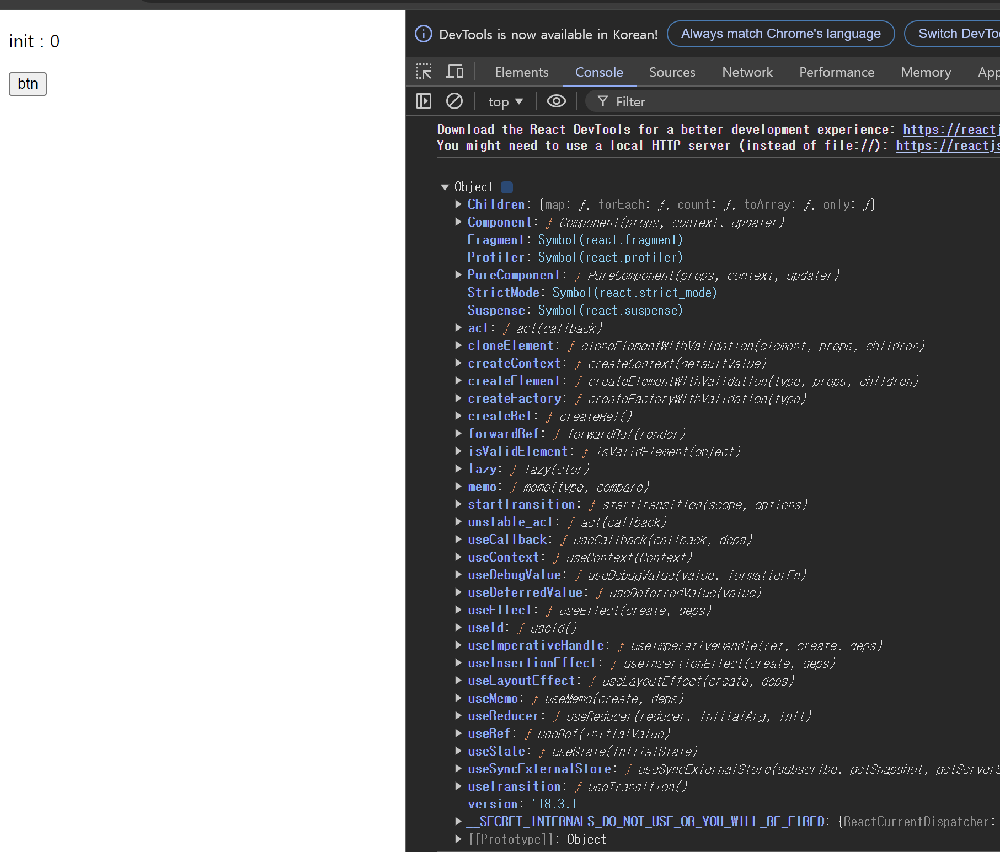
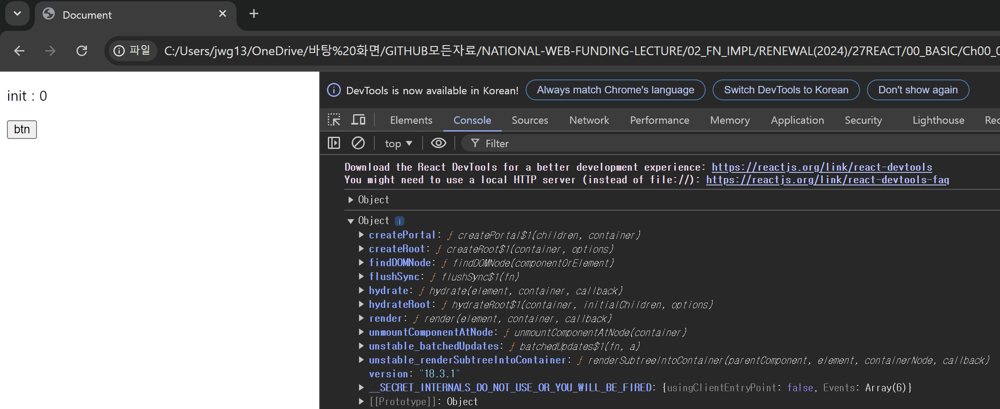

# REACT 

|참고|
|-|
|-|

---
코드확인
---
> 전체코드
```
<!DOCTYPE html>
<html lang="en">
<head>
    <meta charset="UTF-8">
    <meta http-equiv="X-UA-Compatible" content="IE=edge">
    <meta name="viewport" content="width=device-width, initial-scale=1.0">

    <!-- REACT CDN-->
    <script crossorigin src="https://unpkg.com/react@18/umd/react.development.js"></script>
    
    <!-- REACTDOM CDN -->
    <script crossorigin src="https://unpkg.com/react-dom@18/umd/react-dom.development.js"></script>

    <title>Document</title>
</head>
<body>
    <div id="root"></div>
    <button id="btn_plus">btn</button>
    <script>
        //
         console.log(React);
         console.log(ReactDOM);
        //
        const Component = props=>{
            return React.createElement('p',null,`${props.message} : ${props.count} `);
        }
        // 
        ReactDOM.render(
            React.createElement(Component,{message:'init',count:0},null),
            document.querySelector("#root")
        )
        //
        let cnt = 0;
        document.querySelector("#btn_plus").addEventListener('click',()=>{
            ReactDOM.render(
                React.createElement(Component,{message:"update",count:++cnt},null),
                document.querySelector("#root")
            )
        })
    </script>
    
</body>
</html>
```

---
부분확인
---
> CDN
```
    <!-- REACT CDN-->
    <script crossorigin src="https://unpkg.com/react@18/umd/react.development.js"></script>
    // React 라이브러리를 HTML 문서에 포함
    
    <!-- REACTDOM CDN -->
    <script crossorigin src="https://unpkg.com/react-dom@18/umd/react-dom.development.js"></script>
    //ReactDOM 라이브러리를 HTML 문서에 포함
```

>ReactDOM 역할
```
ReactDOM은 React로 작성된 컴포넌트를 실제 DOM(Document Object Model)에 렌더링하는 데 사용됩니다.
React는 가상 DOM을 사용하여 성능을 최적화하지만, 최종적으로는 실제 DOM에 렌더링해야 브라우저에 표시됩니다.

주요 기능:
ReactDOM.render(): React 컴포넌트를 실제 DOM에 렌더링합니다. - 예전방식
ReactDOM.createRoot(): React 18에서 도입된 새로운 Root API를 사용하여 React 애플리케이션의 루트 DOM 노드를 생성하고 렌더링합니다.

```

> console.log(React)<br>
 
|-|
|-|
||

```
    Children: React children 조작 유틸리티 함수들.
    Component: 클래스형 컴포넌트를 정의하는 기본 클래스.
    Fragment: 여러 요소를 그룹화하는 래퍼.
    Profiler: 성능 측정을 위한 컴포넌트.
    PureComponent: shouldComponentUpdate를 통한 성능 최적화 컴포넌트.
    StrictMode: 잠재적 문제 탐지 도구.
    Suspense: 비동기 로딩 상태 표시 컴포넌트.
    act: 테스트 환경에서 업데이트 적용 도구.
    cloneElement: 기존 요소 복제 및 props 전달.
    createContext: 전역 데이터 공유 Context API 생성.
    createElement: 새로운 React 요소 생성 함수.
    createFactory: 특정 타입 요소 생성 팩토리 함수.
    createRef: DOM 요소나 컴포넌트 인스턴스 접근 참조 생성.
    forwardRef: 하위 컴포넌트에 ref 전달.
    isValidElement: 유효한 React 요소인지 확인.
    lazy: 동적 컴포넌트 import로 코드 스플리팅.
    memo: 동일한 props로 재렌더링 방지 최적화 컴포넌트.
    startTransition: 덜 중요한 우선순위로 상태 업데이트.
    unstable_act: act의 불안정한 버전.
    useCallback: 메모이제이션된 콜백 함수 반환.
    useContext: Context 값 가져오는 훅.
    useDebugValue: 커스텀 훅 디버그 값 설정.
    useDeferredValue: 연산 지연시키는 훅.
    useEffect: 렌더링 후 부수 효과 수행 훅.
    useId: 고유한 ID 생성 훅.
    useImperativeHandle: 자식 인스턴스 값을 부모가 참조.
    useInsertionEffect: 동기적으로 부수 효과 처리 훅.
    useLayoutEffect: DOM 업데이트 후 동기적 부수 효과.
    useMemo: 연산 결과 재사용으로 성능 최적화.
    useReducer: 복잡한 상태 로직 관리 훅.
    useRef: 변경 가능한 참조 객체 생성.
    useState: 함수형 컴포넌트 상태 관리 훅.
    useSyncExternalStore: 외부 스토어 동기적 구독 훅.
    useTransition: 덜 중요한 우선순위로 상태 업데이트 훅.
    version: 현재 React 버전
```

> console.log(ReactDOM)<br>
 
|-|
|-|
||

```
    createPortal: 부모 컴포넌트의 DOM 계층 구조 바깥에 자식을 렌더링.
    createRoot: React 애플리케이션의 루트 DOM 노드를 생성하고 렌더링.
    findDOMNode: 특정 컴포넌트의 DOM 노드를 반환 (향후 제거 예정).
    flushSync: 업데이트를 동기적으로 즉시 플러시.
    hydrate: 서버 사이드 렌더링 후, 기존 HTML에 상호작용을 추가.
    hydrateRoot: 초기 HTML과 함께 root를 초기화하고 hydrate.
    render: React 요소를 실제 DOM에 렌더링 (React 18에서 createRoot 사용 권장).
    unmountComponentAtNode: 특정 DOM 노드에서 React 컴포넌트를 언마운트.
    unstable_batchedUpdates: 여러 업데이트를 배치하여 성능 최적화.
    unstable_renderSubtreeIntoContainer: 부모 컴포넌트의 컨텍스트에서 자식을 별도의 DOM 노드에 렌더링 (권장되지 않음).
    version: 현재 ReactDOM의 버전.
```

> COMPONENT 생성

```
   
    const Component = props=>{
            return React.createElement('p',null,`${props.message} : ${props.count} `);
    }

    //React.createElement() 이용해서 가상DOM안의 요소 생성
    //1 인자 : 생성 태그명, 
    //2 인자 : 속성을 지정할 수 있는 객체(null은 속성을 지정하지 않음)
    //3 인자 요소의 내용 ${props.message} : ${props.count} 은 props안의 message와 count속성을 가져와 문자열로 표현

```

> ReactDOM.render
```
    ReactDOM.render(
            React.createElement(Component,{message:'init',count:0},null), 
            document.querySelector("#root")  //랜더링할 위치, 해당요소 내부에 Component요소가 랜더링 됨
    )
    // ReactDOM.render() : 화면(브라우저)에 React Component를 랜더링
    //1 인자 : 렌더링할 React 요소
    //2 인자 : 컴포넌트에 전달할 props 객체
    //3 인자 : 자식 요소(없으면 null)

```

> 이벤트 처리
```
        let cnt = 0;
        document.querySelector("#btn_plus").addEventListener('click',()=>{
            ReactDOM.render(
                React.createElement(Component,{message:"update",count:++cnt},null),
                document.querySelector("#root")
            )
        })
```
