# REACT EVENT 처리

|참고|
|-|
|[참고-1](https://ko.legacy.reactjs.org/docs/handling-events.html)|
|[참고-2](https://velog.io/@yoonvelog/React-%EC%9D%B4%EB%B2%A4%ED%8A%B8-%EC%B2%98%EB%A6%AC)|

---
ON CLICK
---
|-|
|-|
|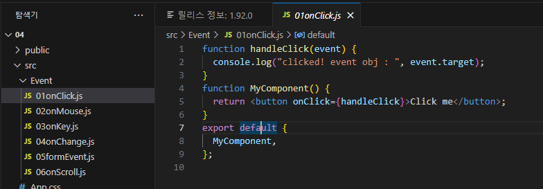|
|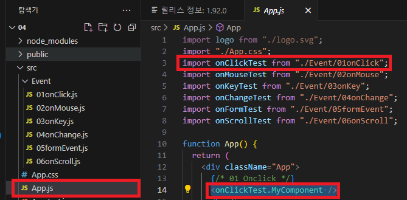|
|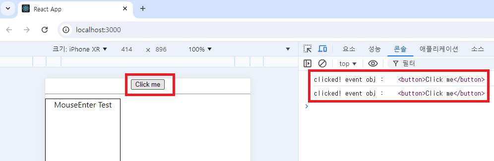|

---
ON MOUSE
---
|-|
|-|
|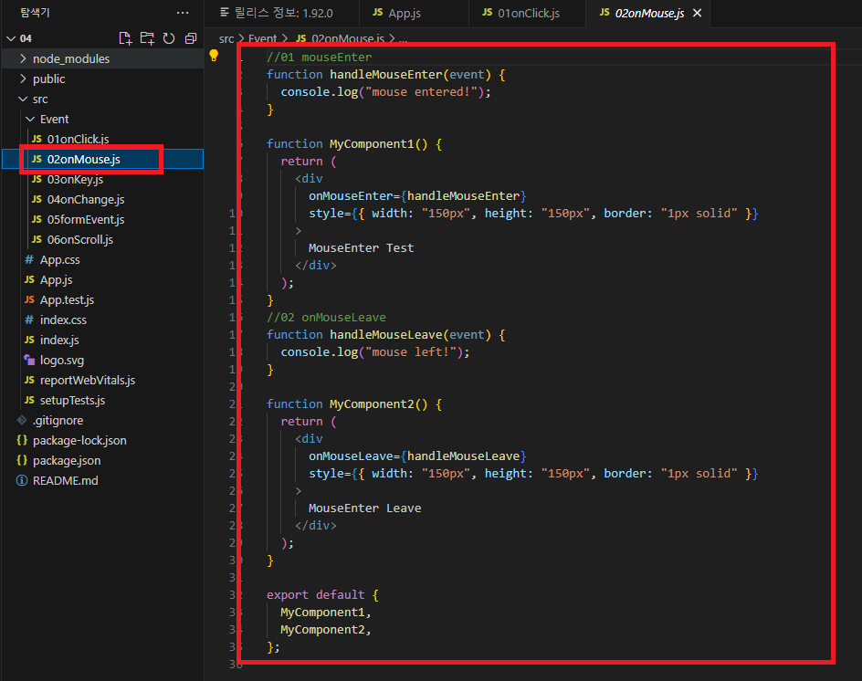|
|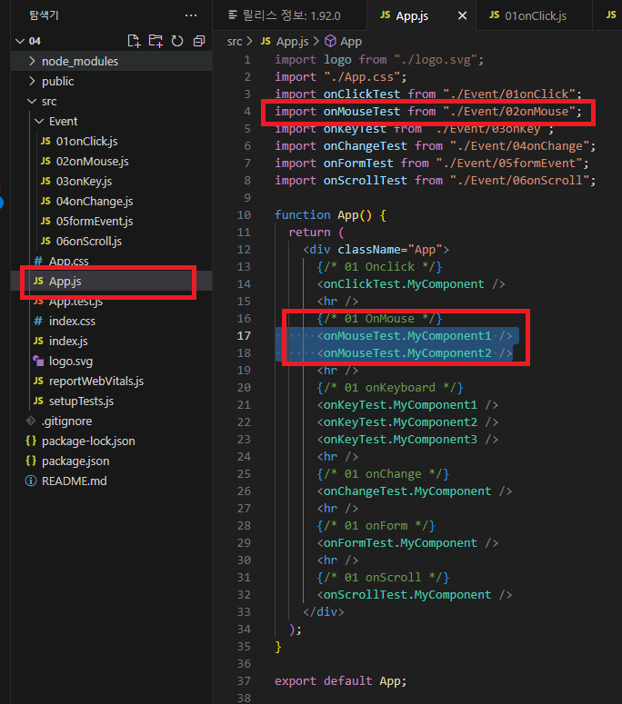|
|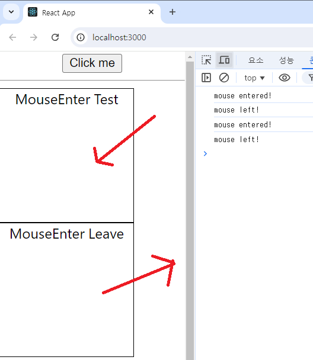|

---
ON KEY
---
|-|
|-|
|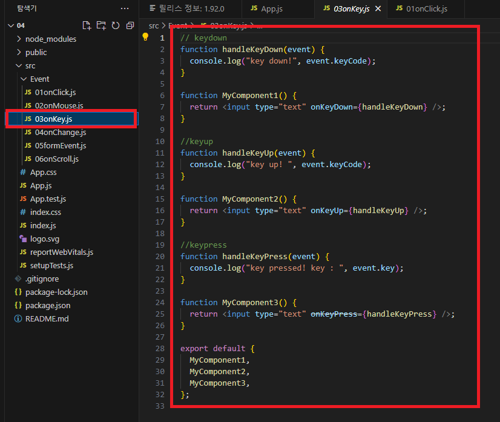|
|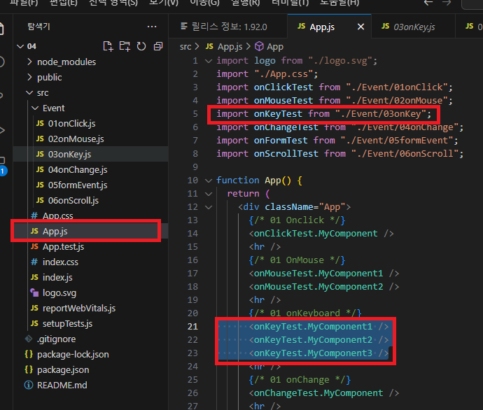|
|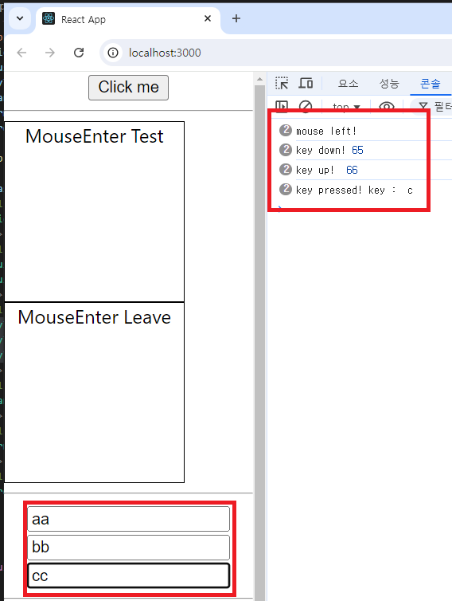|

---
ON CHANGE
---
|-|
|-|
|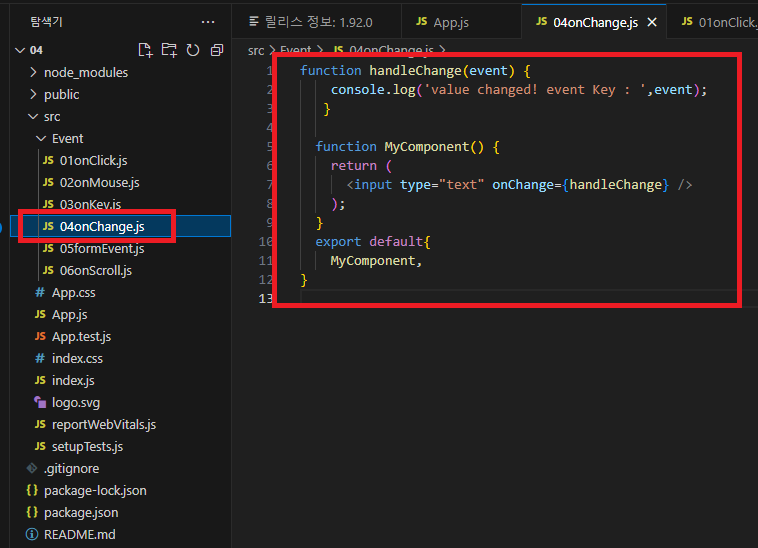|
|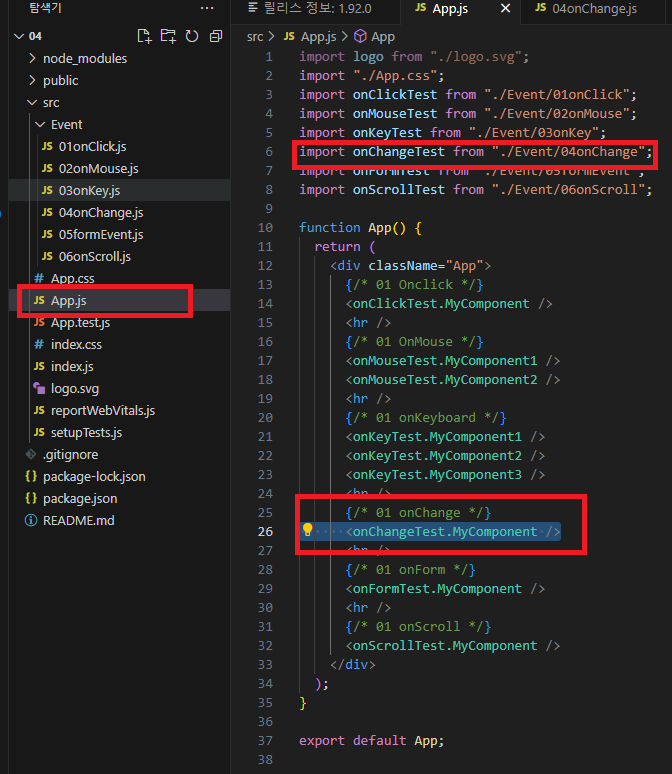|
|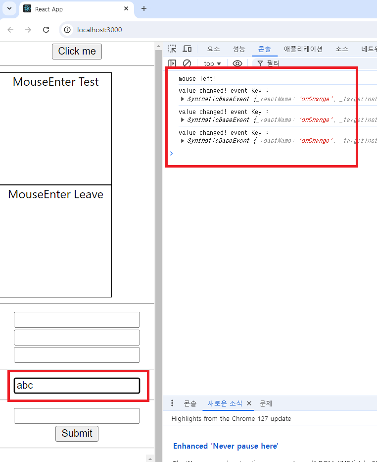|

---
ON SUBMIT
---
|-|
|-|
|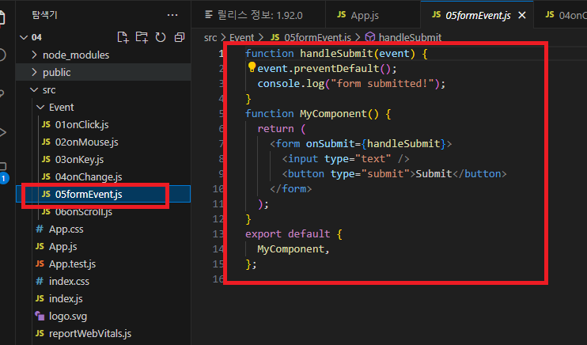|
|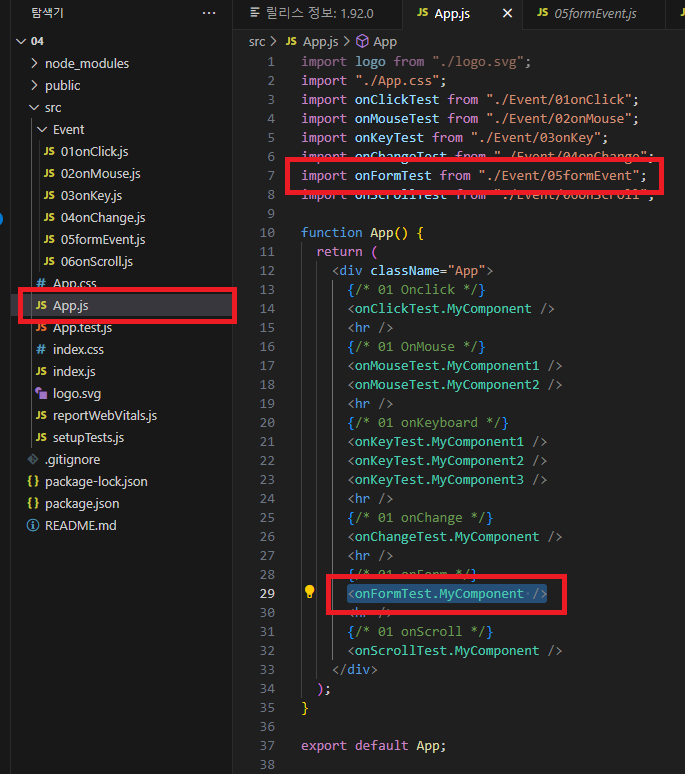|
|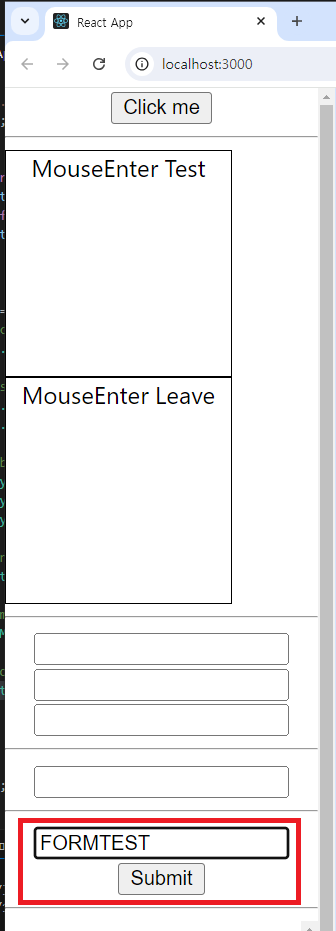|
|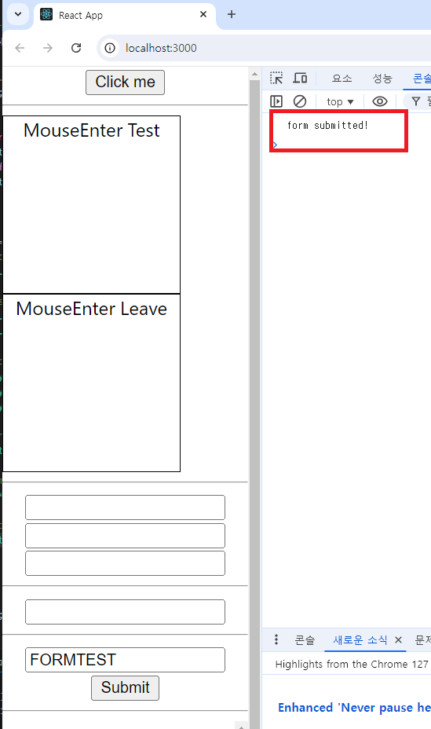|

---
SCROLL
---
|-|
|-|
|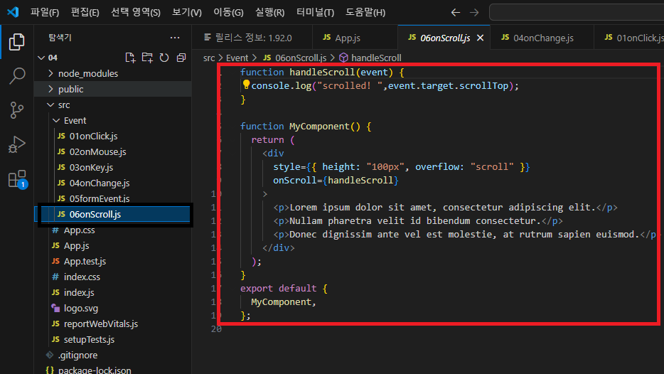|
|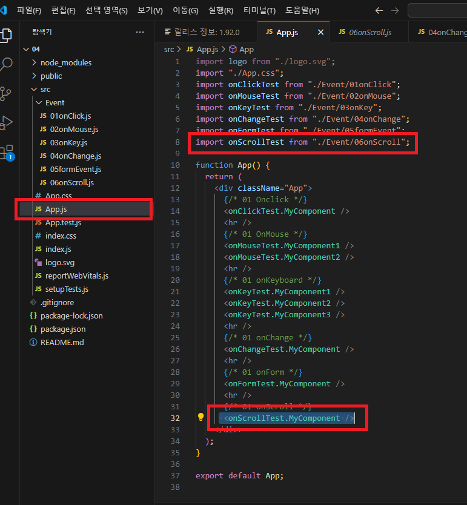|
|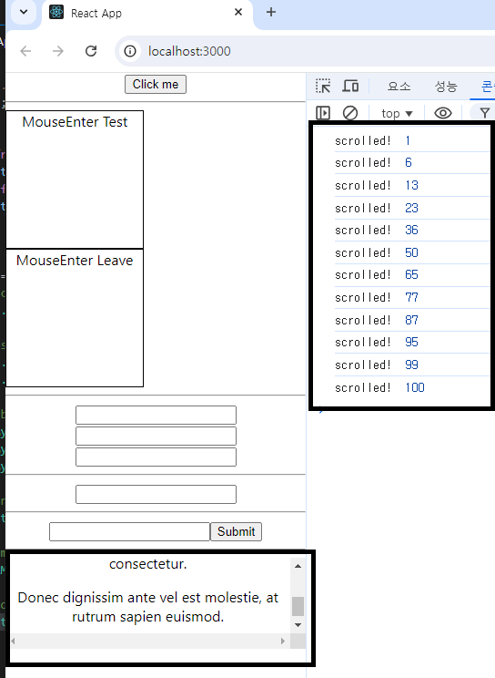|

||
