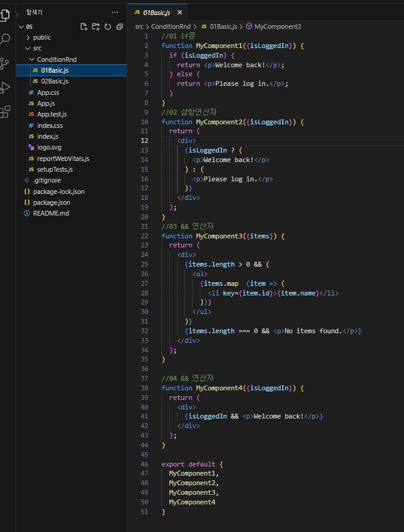
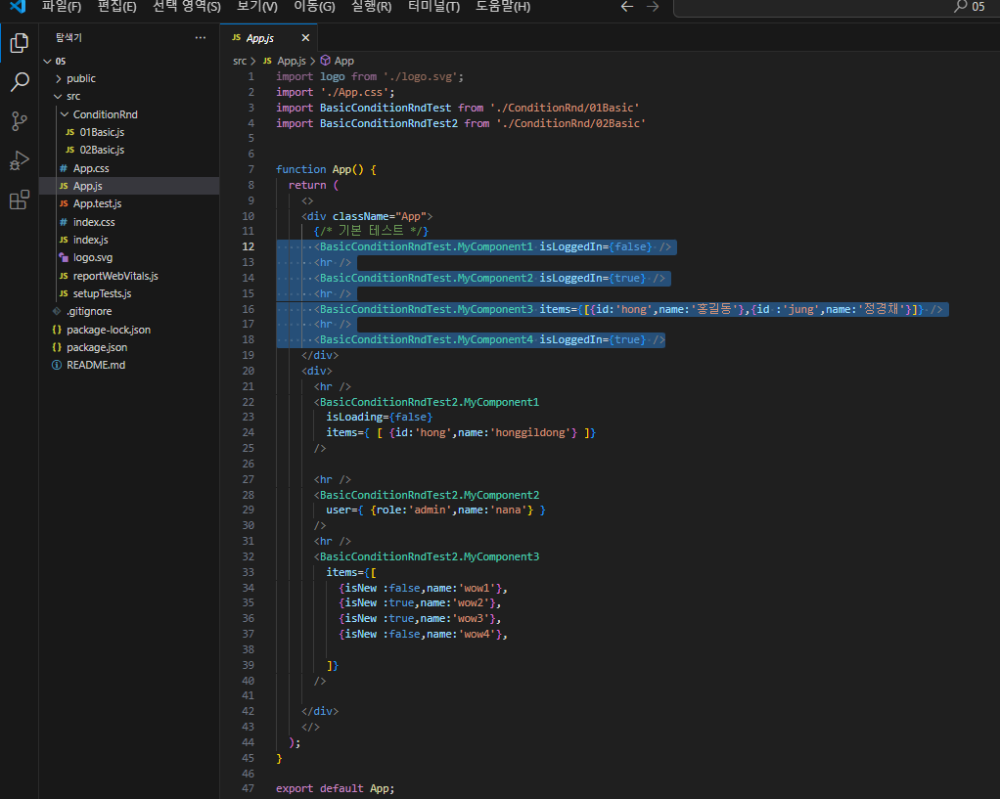
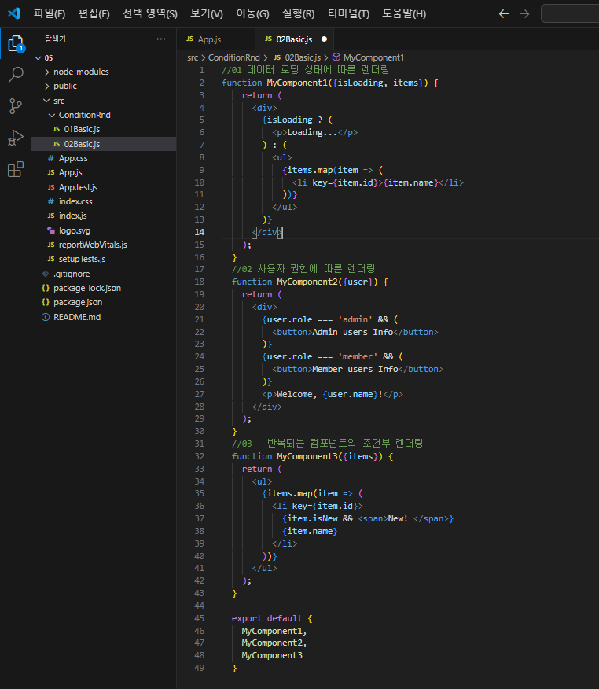
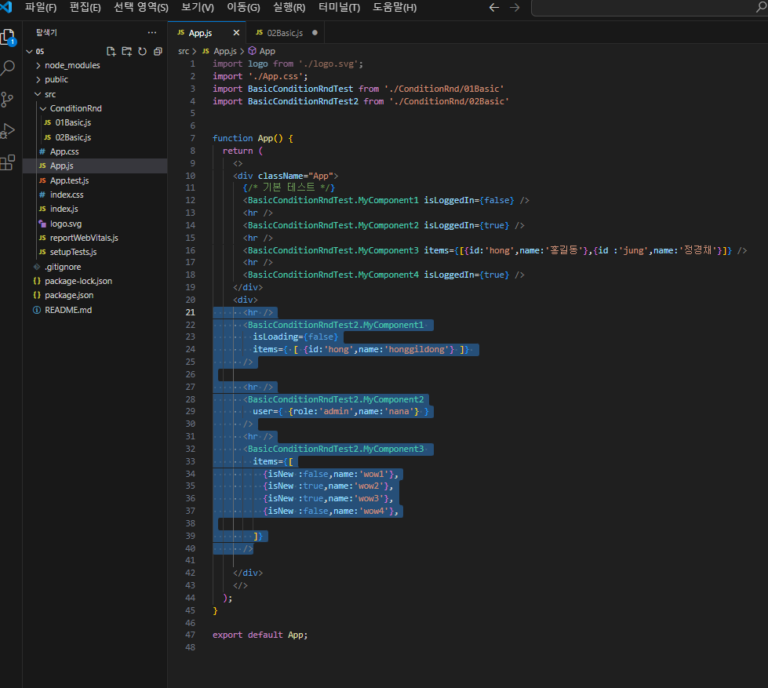
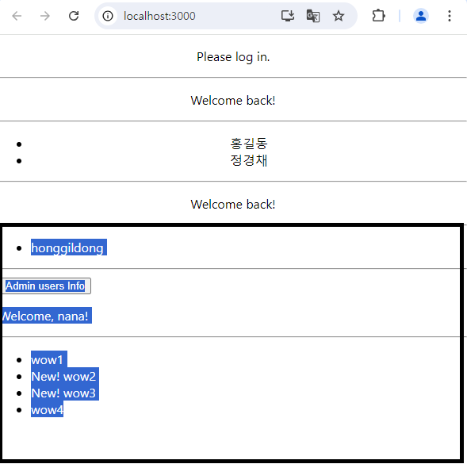

# REACT 조건부렌더링

|참고|
|-|
|[조건부렌더링](https://ko.legacy.reactjs.org/docs/conditional-rendering.html)|
|[조건부렌더링](https://moneytech.kr/103)|

---
조건부렌더링_01
---
|-|
|-|
||
||
||

---
조건부렌더링_02
---
|-|
|-|
||
||
||

