# REACT 

|참고|
|-|
|[리스트&키](https://ko.legacy.reactjs.org/docs/lists-and-keys.html)|
|[리스트&키](https://velog.io/@ssoon-m/react-key-%EC%A0%9C%EB%8C%80%EB%A1%9C-%EB%8B%A4%EB%A3%A8%EA%B8%B0)|

---
리스트와 키
---
|-|
|-|
|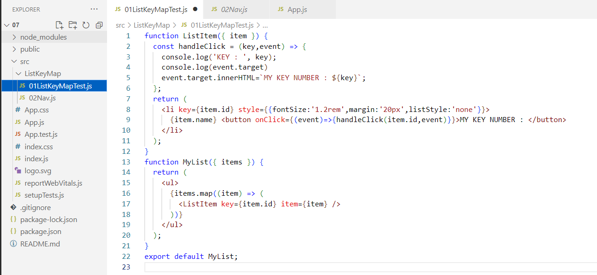|
|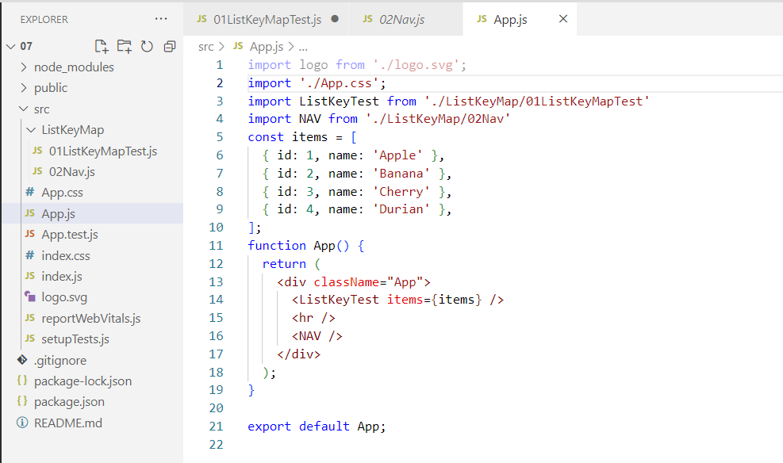|
|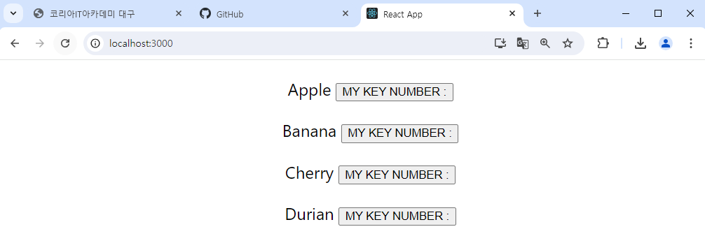|
|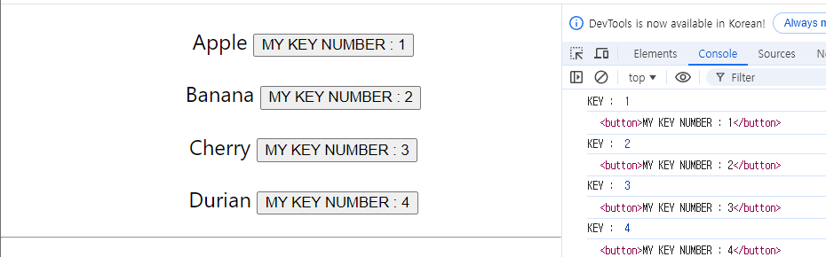|
|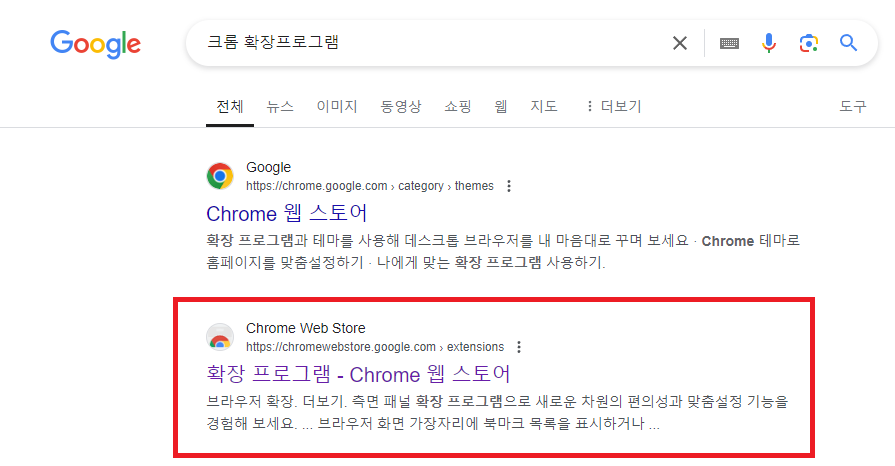|
|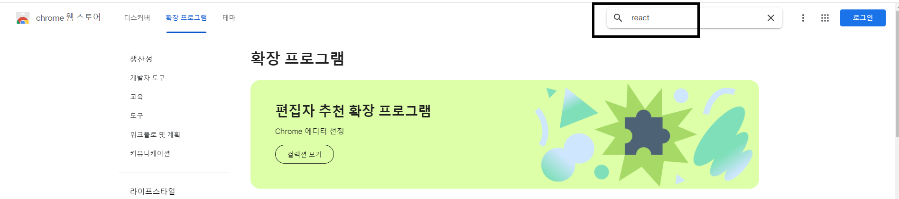|
|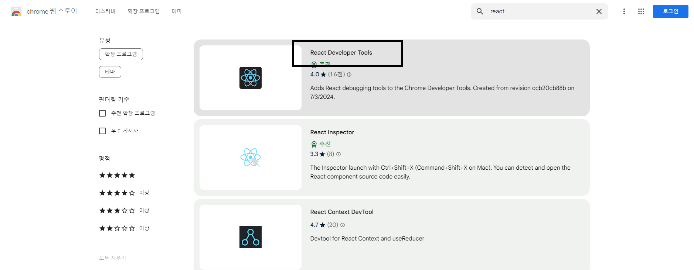|
|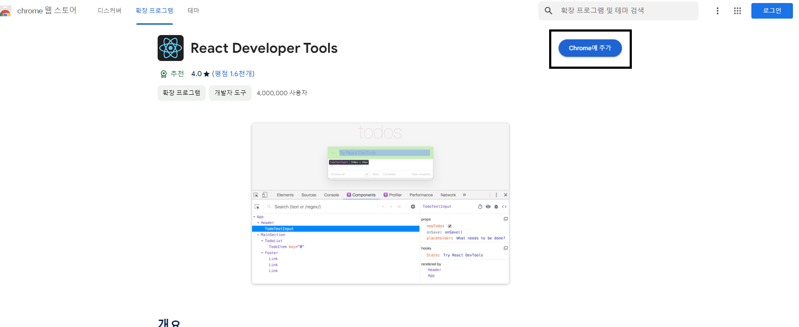|
|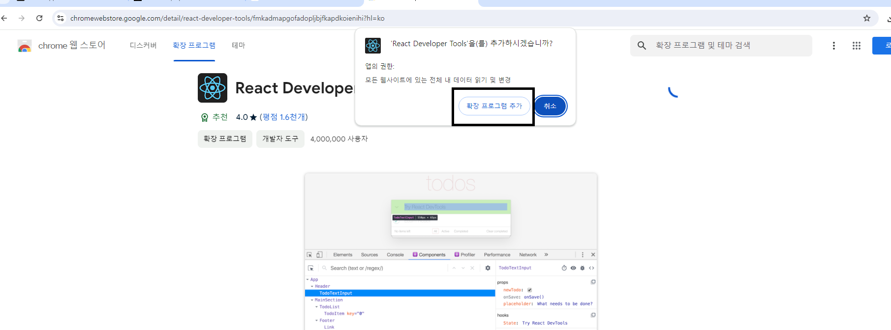|
|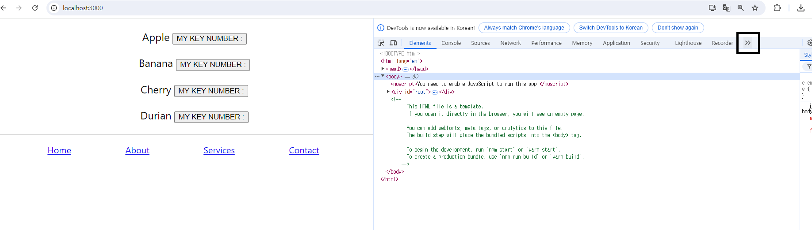|
|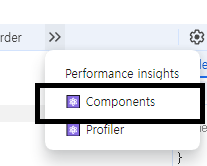|
|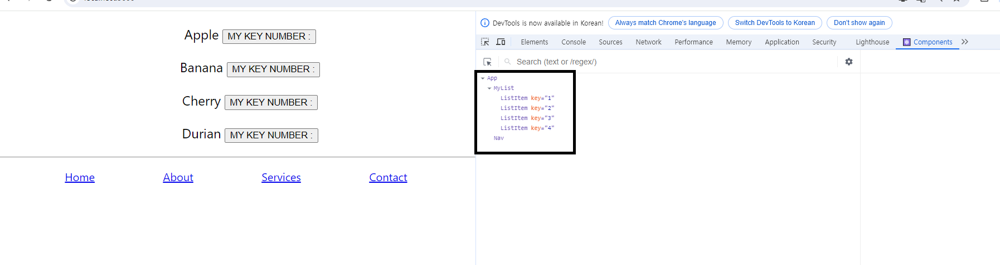|
|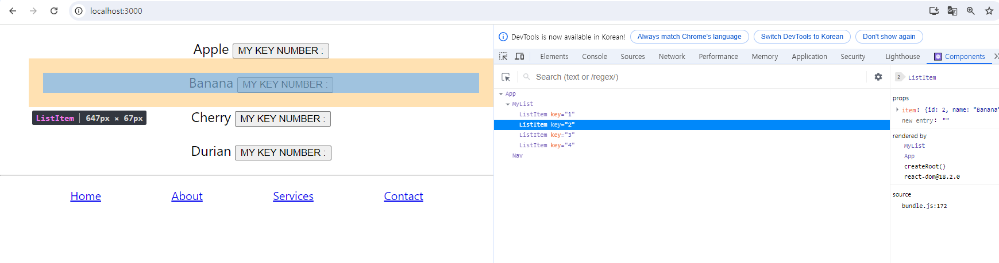|

