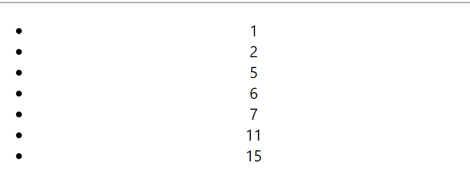

# REACT 

|참고|
|-|
|-|

---
제목 1
---
> REACT HOOK이란
```
리액트 훅(React Hook)은 함수형 컴포넌트에서도 상태(state)나 
생명주기(lifecycle) 메서드 등 클래스형 컴포넌트에서 사용할 수 있는 
기능을 제공하는 것입니다. React 16.8 버전부터 추가된 기능으로, 함수형
 컴포넌트에서 상태 관리와 생명주기 관련 로직을 더 쉽게 작성할 수 있게 해줍니다.

기존에는 함수형 컴포넌트에서 상태를 관리하기 위해서 useState를 사용하고,
 생명주기 관련 로직을 작성하기 위해서는 useEffect 등의 함수를 사용해야 
 했습니다. 하지만 이러한 방법은 상태나 생명주기 메서드가 많아질수록 코드
 의 복잡도가 높아지고 유지보수도 어려워졌습니다.

리액트 훅을 이용하면, useState 훅으로 상태를 관리하고 useEffect 훅으로 
생명주기 관련 로직을 작성할 수 있습니다. 또한, 커스텀 훅(custom hook)을
 만들어서 로직을 재사용할 수 있도록 해줍니다. 예를 들어, 여러 컴포넌트에
 서 공통으로 사용하는 로직을 하나의 커스텀 훅으로 만들어서 사용할 수 있습니다.
```
> REACT HOOK 종류
```
React Hook은 React 16.8 버전부터 도입된 기능으로, 함수형 컴포넌트에서도 상태 관리와 라이프사이클 이벤트 등의 기능을 사용할 수 있게 해줍니다.
주요 React Hook 종류는 다음과 같습니다:

useState: 상태(state)를 관리하기 위해 사용됩니다.
useEffect: 렌더링 직후에 실행되며, 컴포넌트의 부수 효과(side effects)를 처리하기 위해 사용됩니다.
useContext: 전역 데이터를 관리하기 위해 사용됩니다.
useReducer: 상태(state)를 관리하기 위해 사용됩니다. useState보다 복잡한 로직에서 사용됩니다.
useCallback: 함수를 캐싱하기 위해 사용됩니다.
useMemo: 값을 캐싱하기 위해 사용됩니다.
useRef: 컴포넌트 내부에서 참조(reference) 값을 저장하기 위해 사용됩니다.
useImperativeHandle: useRef와 함께 사용되며, 부모 컴포넌트에서 자식 컴포넌트의 메서드를 호출하기 위해 사용됩니다.
useLayoutEffect: useEffect와 비슷한 역할을 하지만, 렌더링 직후 DOM 노드의 크기나 위치 등을 변경할 때 사용됩니다.
useDebugValue: 커스텀 훅에서 사용됩니다. 디버깅에 유용합니다.

useMemo: 값을 캐싱하기 위해 사용됩니다.????

useMemo는 계산된 값을 캐싱하여, 동일한 계산이 반복될 때 계산 시간을 절약하는 
것을 말합니다.

예를 들어, 리액트 컴포넌트에서 특정 값을 계산하고, 이 값이 변경되지 않았을 때 
이전 값으로 재사용할 수 있습니다. 이때 useMemo를 사용하면 계산된 값을 캐싱하여 
다음 렌더링에서 동일한 계산을 다시 수행하지 않고 이전 값을 재사용할 수 있습니다.

이를 통해 애플리케이션의 성능을 최적화할 수 있습니다. 만약 값이 변경될 가능성이 
있는 경우, 캐시된 값을 다시 계산하고 갱신해주어야 합니다.
```


---
실습
---
> useState
```
```
|-|
|-|
| | 
| | 
| | 


> useEffect
```
```
|-|
|-|
| | 
| | 
| | 


> useContext
```
```
|-|
|-|
| | 
| | 
| | 
| | 
| | 


> useReduce
```
```
|-|
|-|
| | 
| | 
| | 
| | 
| | 


> useCallback
```
```
|-|
|-|
| | 
| | 
| | 
| | 


> useMemo
```
```
|-|
|-|
| | 
| | 
| | 


> customHook/useLocalStorage
```
```
|-|
|-|
| | 
| | 
| | 
| | 
| | 


