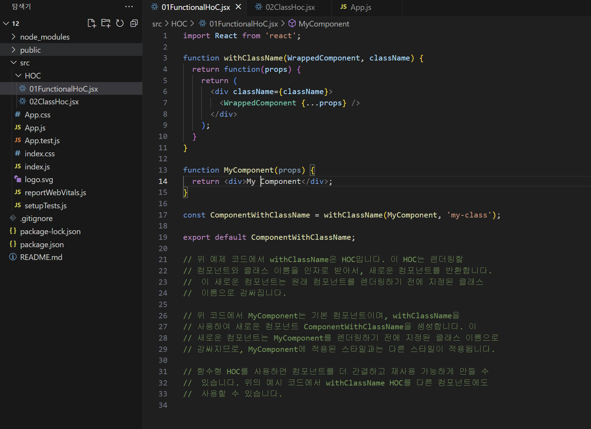
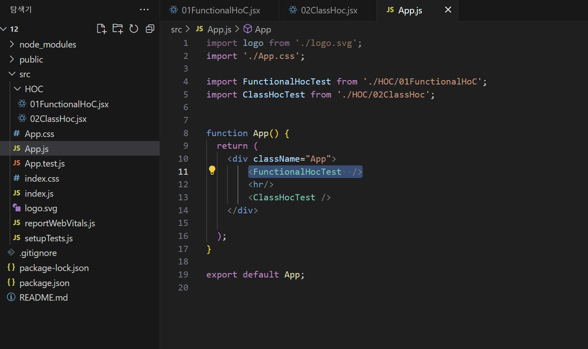
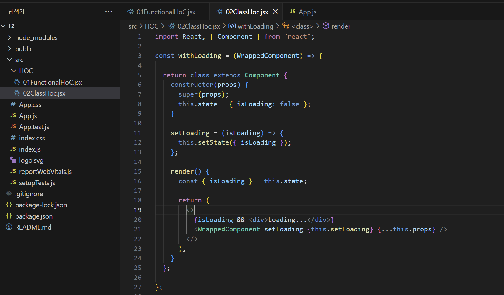
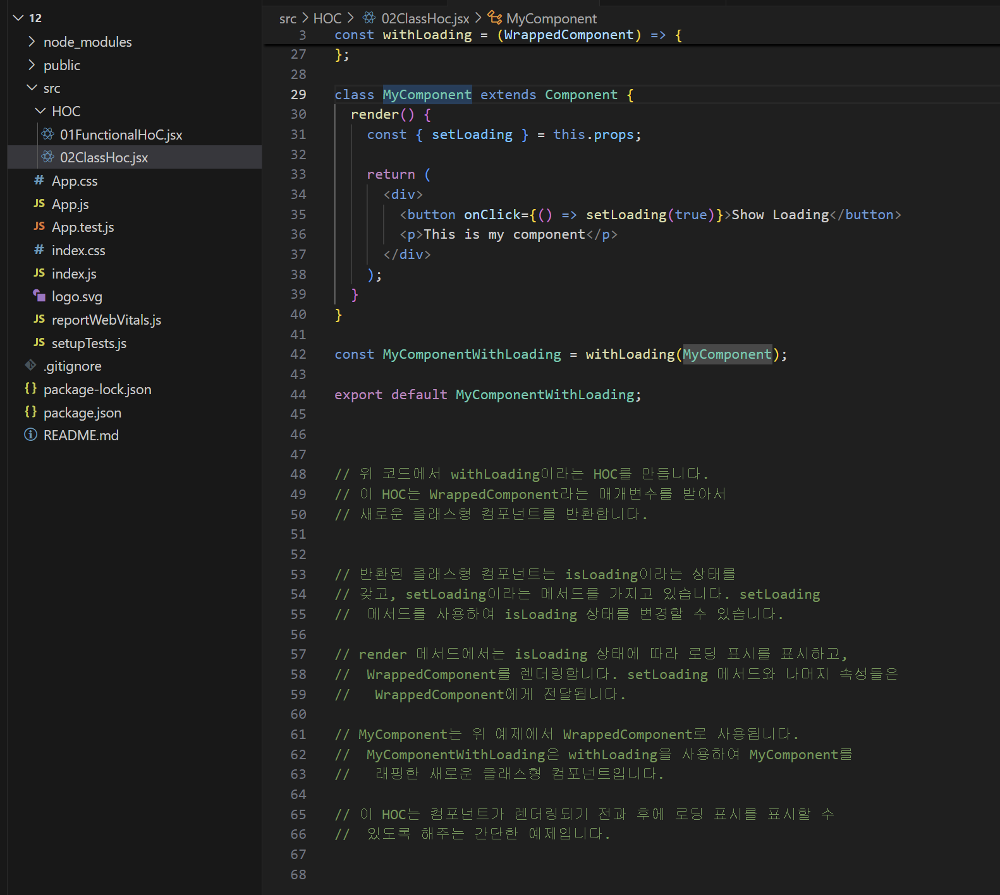
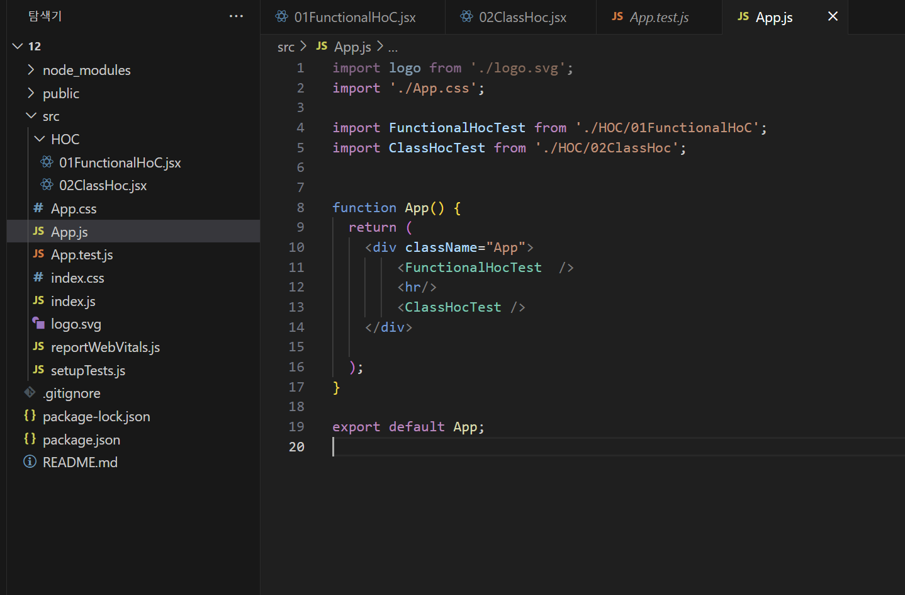
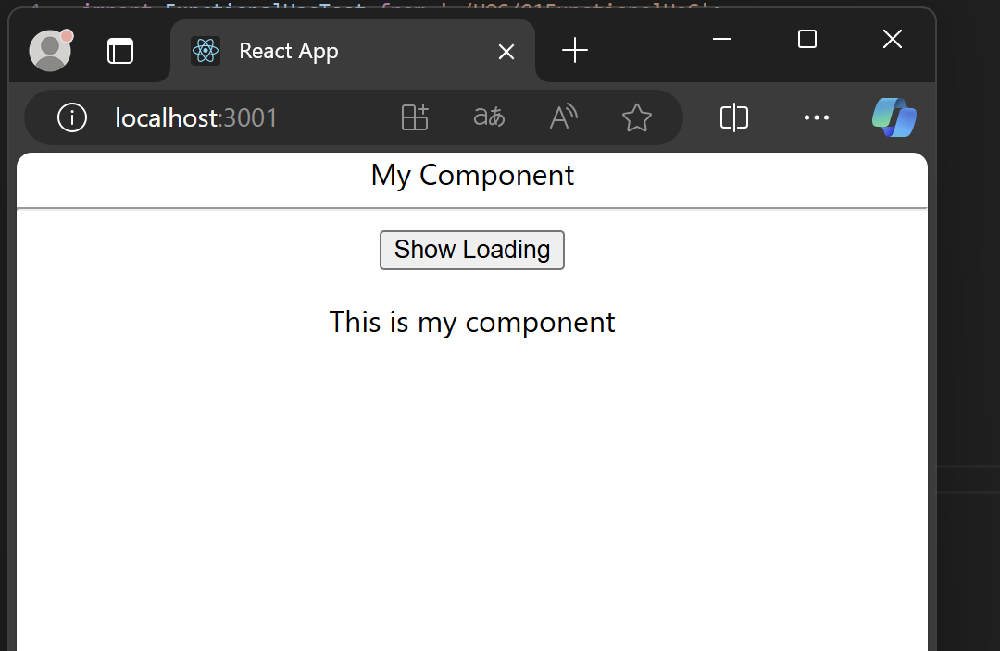
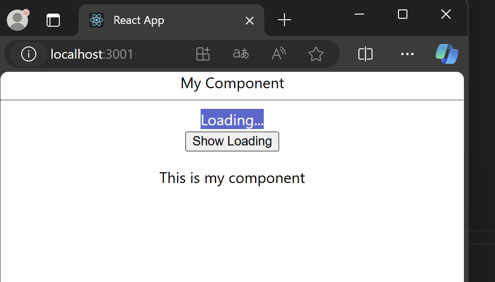

# REACT 

|참고|
|-|
|[HOC란_1](https://ko.legacy.reactjs.org/docs/higher-order-components.html)|
|[HOC란_2](https://jiyoon-park.tistory.com/entry/React-HOC%EC%97%90-%EB%8C%80%ED%95%B4-%EC%95%8C%EC%95%84%EB%B3%B4%EC%9E%90)|

---
HOC
---
> HOC란
```
HOC(High-Order Component)는 React에서 컴포넌트를 재사용할 수 있는 패턴 중 하나
HOC는 컴포넌트를 인자로 받아서 새로운 컴포넌트를 반환하는 함수
```

---
HOC 실습
---
> -
```
```
|-|
|-|
||
||
||
||
||
||
||


