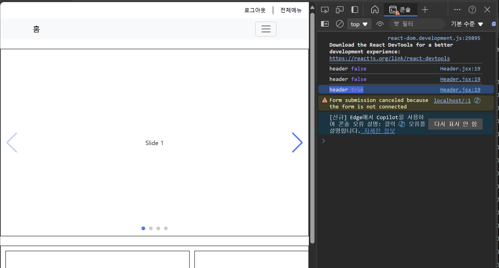
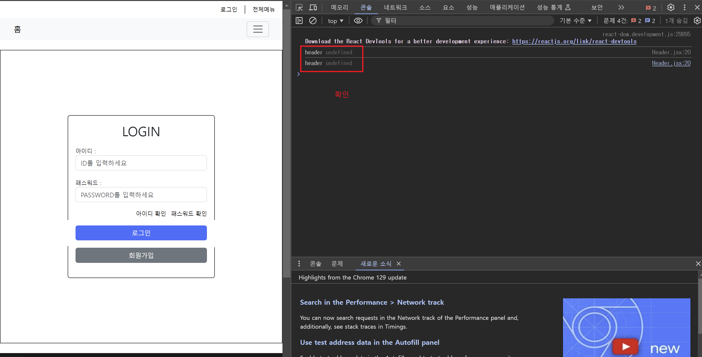

# REACT CONTEXTAPI_COOKIE

---
CONEXTAPI
---
> CONTEXT API 를 이용하여 모든 자식요소에서 사용될 전역변수를 만듭니다.

|-|
|-|
|
|
|
|
|
|
|

---
로그인/로그아웃
---
> 로그인/로그아웃 컴포넌트에서 Context에서 설정한 상태변수를 변경합니다

|-|
|-|
|
|
|
|
|
|
|
|

---
COOKIE 
---
> CONTEXT + COOKIE 로 상태정보를 브라우저에 일정시간동안 유지 보관합니다

|-|
|-|
|
|
|
|
|
|
|
|
|

---
Tracker
---
> Router의 Route 경로 이동시에 전역으로 사용할 기능을 추가합니다 
> 다른 경로로 이동시 로그인 상태 쿠키 값을 초기화(10분)시킵니다.

|-|
|-|
|
|
|

