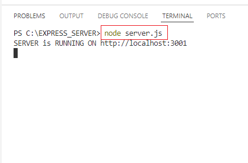
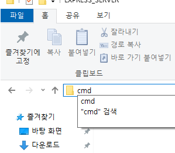
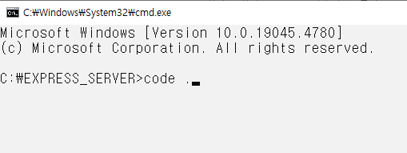
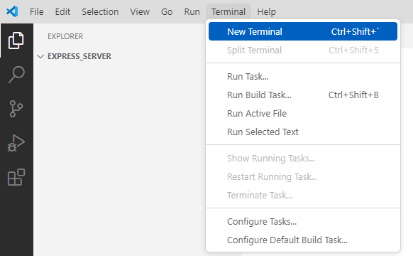
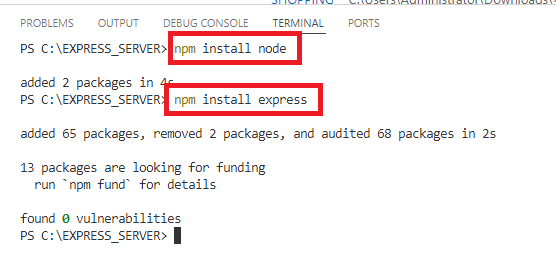
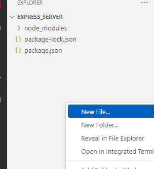
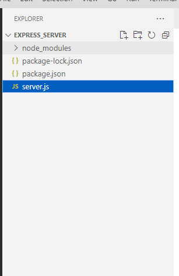
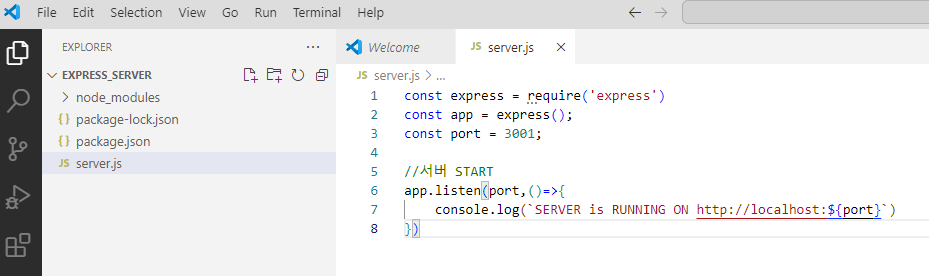

# EXPRESSJS 시작하기


|-|
|-|
||
||
||
||
||
||
||
||


```
const express = require('express')
  express 모듈을 불러옵니다. Express는 Node.js에서 웹 서버를 구축할 때 자주 사용되는 프레임워크입니다.
  require() 함수는 Node.js에서 모듈을 불러오기 위해 사용됩니다.

const app = express();
  express()를 호출하여 app이라는 변수에 Express 애플리케이션 객체를 생성합니다. 이 객체는 서버 설정, 요청 처리 등을 담당합니다.

const port = 3001;
  서버가 실행될 포트 번호를 지정합니다. 여기서는 3001번 포트를 사용하도록 설정하였습니다. 포트는 서버와 클라이언트 간의 통신에 사용됩니다.

app.listen(port, () => {
  app.listen() 메서드를 사용하여 서버를 실행합니다. 서버는 지정한 포트(3001)에서 클라이언트의 요청을 기다리게 됩니다.
  첫 번째 인자인 port는 서버가 실행될 포트 번호이며, 두 번째 인자인 콜백 함수는 서버가 성공적으로 시작되었을 때 실행됩니다.

console.log(SERVER is RUNNING ON http://localhost:${port}`)`
  서버가 성공적으로 실행되면 콘솔에 "SERVER is RUNNING ON http://localhost:3001"라는 메시지를 출력하여 서버가 정상적으로 실행 중임을 알려줍니다.
  템플릿 리터럴(``)을 사용하여 port 변수를 동적으로 삽입하고 있습니다.
```


